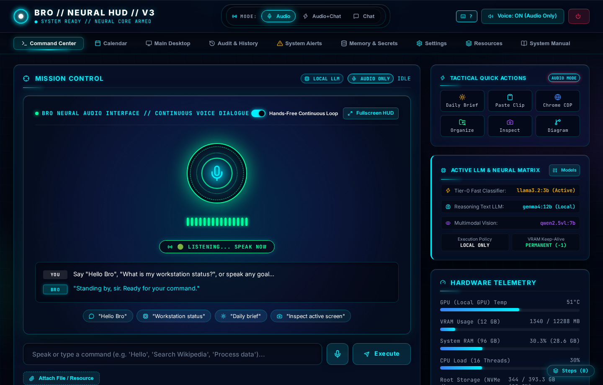
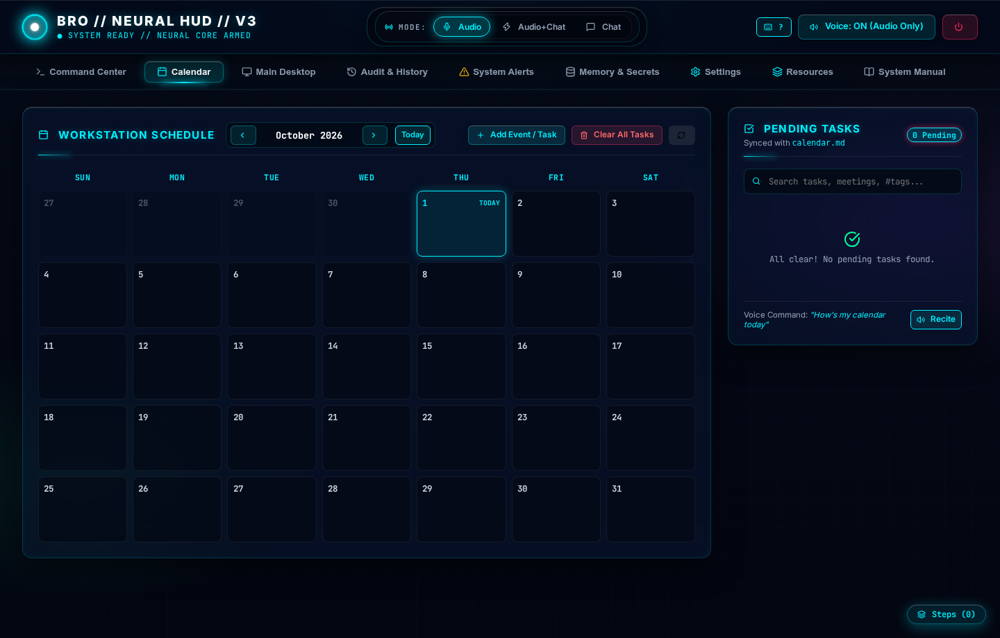
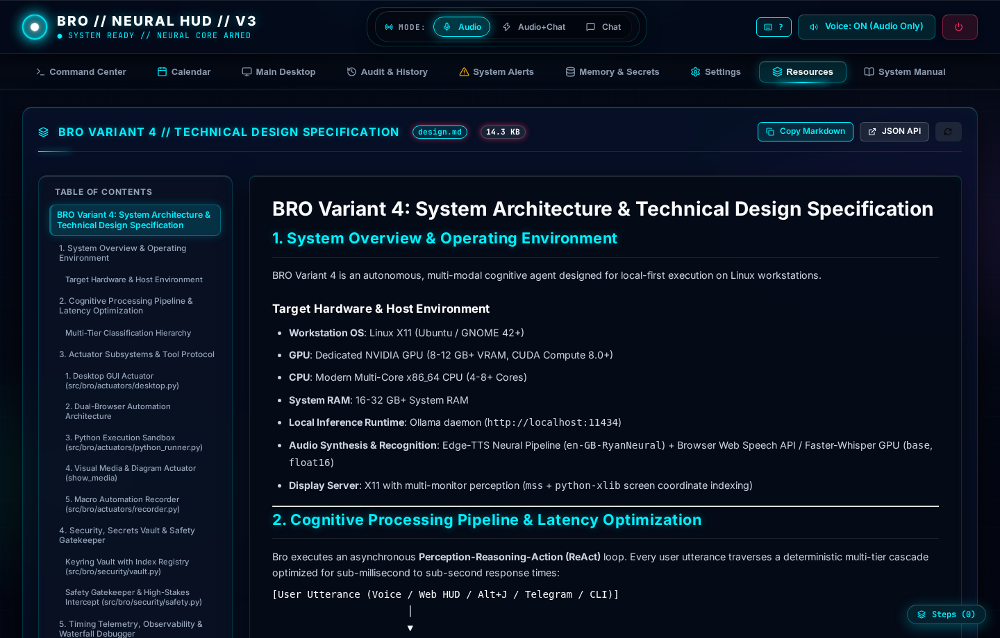
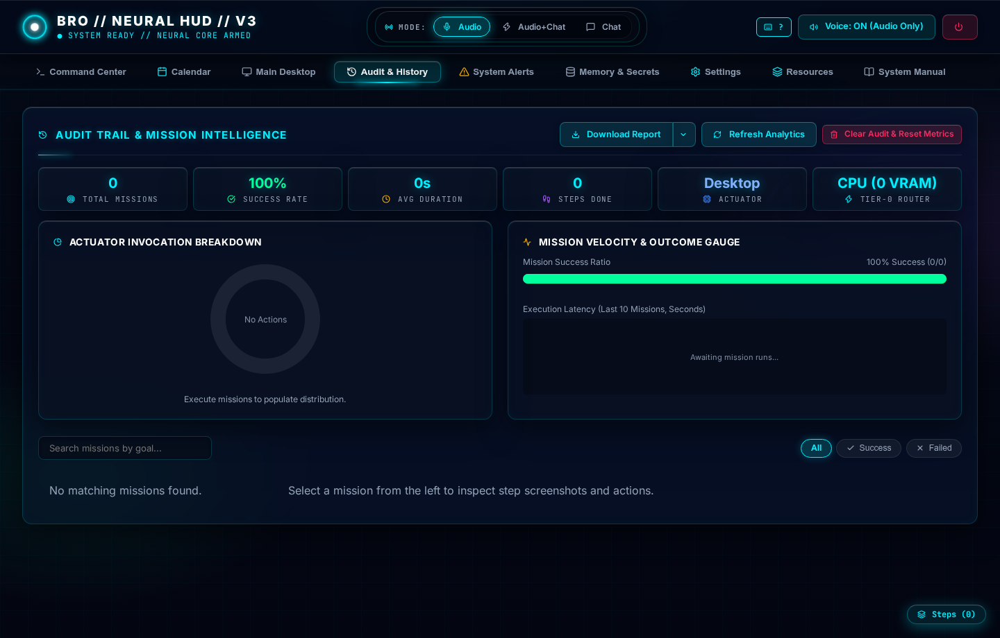
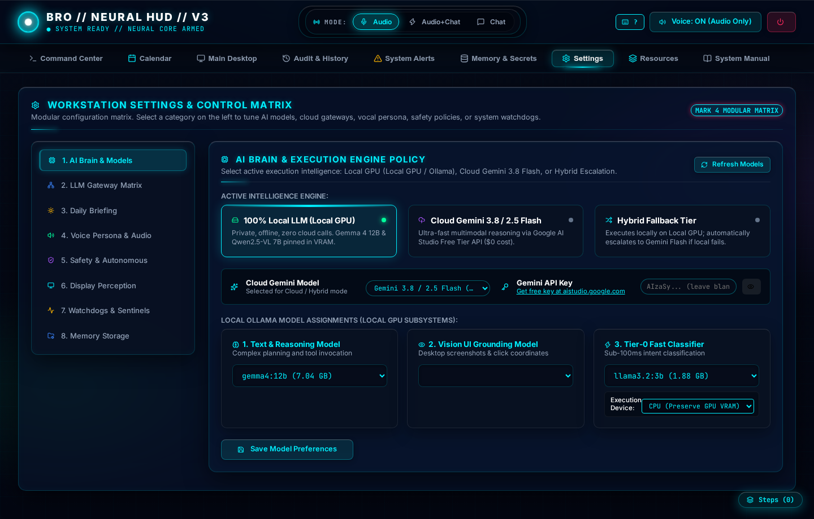

<div align="center">

# ⚡ BRO: Autonomous Personal AI Assistant for Linux Workstations

**Local-First • Multi-Modal Computer Use • Hybrid RAG • Enterprise LLM Gateway • Real-Time Voice**

[](https://www.python.org/)
[](https://fastapi.tiangolo.com/)
[](https://ollama.ai/)
[](https://playwright.dev/)
[](.github/workflows/ci.yml)
[](https://opensource.org/licenses/MIT)

<p align="center">
  <a href="#-system-tour--tactical-hud">System Tour</a> •
  <a href="#-cognitive-architecture">Architecture</a> •
  <a href="#-key-capabilities">Capabilities</a> •
  <a href="#-quickstart--installation">Quickstart</a> •
  <a href="#-configuration--environment">Configuration</a> •
  <a href="#-limitations--runtime-constraints">Limitations</a> •
  <a href="#-developer-guide">Developer Guide</a>
</p>

</div>

---

## 📖 Overview

**BRO** is a state-of-the-art autonomous personal cognitive agent built specifically for power-user Linux workstations. Operating on a **local-first philosophy with zero required cloud billing**, Bro controls your operating system, drives desktop applications, inspects active window hierarchies, automates web browsers, manages your workstation calendar, and indexes your personal knowledge base.

Bro combines **local sub-millisecond pattern matching**, **GPU-accelerated reasoning models (Gemma / Llama / Qwen-VL)**, and an **Enterprise Multi-Provider LLM Gateway** with intelligent circuit breaking and automatic failover across Google Gemini, OpenAI, Groq, Meta AI, and Ollama.

---

## 📸 System Tour & Tactical HUD

Bro features a modern, glassmorphic cyber-tactical Web HUD hosted locally at `http://127.0.0.1:8765`.

### 1. Command Center & Active Cognitive State
*Real-time audio waveform visualizer, active model topology container, live hardware telemetry, system activity stream, and one-click quick triggers.*


### 2. Workstation Calendar & Task Engine
*Interactive monthly agenda matrix, markdown-synchronized event tracking (`calendar.md`), and single-click memory cleanup with confirmation safety.*


### 3. Integrated Engineering Resources & System Design
*Full in-HUD hosting and live rendering of deep technical design specifications (`design.md`) and complete operator manuals (`user-guide.md`).*


### 4. Telemetry Analytics & Mission Audit Trail
*Real-time performance KPI cards, interactive SVG Actuator Distribution Donut, execution velocity bar charts, and step-by-step visual lightboxes.*


### 5. Multi-Provider Gateway & Unified Settings Matrix
*Centralized control plane for model routing policies, watchdog thresholds, Obsidian RAG directories, and customizable Gen-Z vocal salutations.*


---

## 🏗️ Cognitive Architecture

Bro executes an asynchronous **Perception-Reasoning-Action (ReAct)** loop with a deterministic multi-tier cascade designed for minimal latency:

```
[User Utterance (Voice / Web HUD / Alt+J Spotlight / Telegram / CLI)]
                       │
                       ▼
    ┌─────────────────────────────────────────────────────────────┐
    │ Tier -1: Greeting Matcher (<1ms CPU Regex)                  │
    │ Evaluates 40+ compiled expressions for instant salutations  │
    └──────────────────────────────┬──────────────────────────────┘
                                   │ (No Match)
                                   ▼
    ┌─────────────────────────────────────────────────────────────┐
    │ Tier -0b: Local Intent Matcher (<5ms MD5 Cache)             │
    │ Dynamic deterministic actions: time, calendar, file preview │
    └──────────────────────────────┬──────────────────────────────┘
                                   │ (No Match)
                                   ▼
    ┌─────────────────────────────────────────────────────────────┐
    │ Acoustic Pre-Response Engine (<200ms)                       │
    │ Fires non-blocking verbal ack ("Processing your command...")│
    └──────────────────────────────┬──────────────────────────────┘
                                   │
                                   ▼
    ┌─────────────────────────────────────────────────────────────┐
    │ Tier-0: Fast Intent Router (Llama 3.2 3B CPU/GPU) (<100ms)  │
    │ Categorizes into CONVERSATION (Fast QA) or COMPLEX_PLAN     │
    └──────────────────────────────┬──────────────────────────────┘
                                   │
        ┌──────────────────────────┴──────────────────────────┐
        │ (Conversation)                                      │ (Complex Task)
        ▼                                                     ▼
┌───────────────────────────────┐     ┌─────────────────────────────────────────────────────────┐
│ Direct Voice / Text Reply     │     │ Tier-1: Deep Reasoning Engine (Gemma 4 12B pinned VRAM) │
│ Delivers response in <150ms   │     │ Multi-turn tool execution & structured JSON schemas     │
└───────────────────────────────┘     └───────────────────────────┬─────────────────────────────┘
                                                                  │
                                       ┌──────────────────────────┼─────────────────────────────┐
                                       │                          │                             │
                                       ▼                          ▼                             ▼
                        ┌────────────────────────┐   ┌──────────────────────────┐   ┌────────────────────────┐
                        │ Vision Perceiver       │   │ Enterprise LLM Gateway   │   │ Safety Gatekeeper      │
                        │ Qwen2.5-VL (7B)        │   │ Fallback: Gemini ⇄ OpenAI│   │ Intercepts high-stakes │
                        │ Desktop screen inspect │   │ Groq ⇄ Meta ⇄ Ollama     │   │ commands (rm, sudo)    │
                        └──────────────┬─────────┘   └────────────┬─────────────┘   └───────────┬────────────┘
                                       │                          │                             │
                                       └──────────────────────────┼─────────────────────────────┘
                                                                  │
                                                                  ▼
                                            ┌───────────────────────────────────────────┐
                                            │ Actuator Execution Suite                  │
                                            │ • Desktop GUI (mss + pyautogui + xprop)   │
                                            │ • Everyday Browser (Chrome CDP port 9222) │
                                            │ • Sandboxed Web (Playwright Chromium)     │
                                            │ • Python Runner (Data crunching & API)    │
                                            └───────────────────────────────────────────┘
```

---

## 🌟 Key Capabilities

### 1. Local-First Privacy & Zero Cloud Cost
* Bro operates entirely offline using local Ollama models. Your code, keystrokes, personal notes, and desktop screenshots never leave your workstation unless cloud fallback is explicitly enabled.

### 2. Multi-Provider Enterprise LLM Gateway
* An enterprise gateway subsystem (`src/bro/gateway/`) offering unified routing, priority cascading, latency tracking, and automatic circuit breaking across **Google Gemini**, **OpenAI (GPT-4o/o3)**, **Groq (Llama-3)**, **Meta AI**, and **Local Ollama**.

### 3. Deep X11 Desktop & Multi-Monitor Perception
* Direct integration with the X11 window manager via `xprop` enables Bro to read `_NET_ACTIVE_WINDOW` (focused application and document title) and `_NET_CLIENT_LIST` (all open workspace windows).
* Multi-monitor canvas coordinate mapping lets you target specific physical monitors (Display 1, Display 2) or the entire virtual desktop.

### 4. Zero-VRAM Tier-0 CPU Offloading
* Offload intent classification (`llama3.2:3b`) entirely to host CPU threads (`tier0_device: cpu`), reserving 100% of GPU VRAM for the primary reasoning model (`gemma4:12b`) and multimodal vision model (`qwen2.5-vl:7b`).

### 5. Acoustic Pre-Responses & Natural Speech Synthesis
* Bro fires non-blocking verbal cues (*"Looking into that now..."*, *"On it, Sir..."*) within 200ms to eliminate perceived dead air before deep reasoning begins.
* Automated phonetic normalization converts technical memory units (`GiB` $\rightarrow$ `GB`, `MiB` $\rightarrow$ `MB`), latencies (`ms` $\rightarrow$ `milliseconds`), and acronyms into natural human speech.

### 6. Obsidian Knowledge Base Hybrid RAG
* Dual-engine indexing combining **BM25 keyword search** and **dense vector embeddings (`nomic-embed-text`)** across `~/ai-memory/bro` and your personal Obsidian Vault notes.

### 7. Proactive Watchdogs & Hardware Sentinels
* Continuous background sentinels monitor GPU temperatures and disk space thresholds.
* Download Organizer auto-sorts incoming files in `~/Downloads` into categorized directories (`PDFs`, `Data`, `Archives`, `Media`).

### 8. Two-Way Remote Telegram Companion
* Secure mobile control bridge supporting voice note transcription, text query execution, and remote desktop screenshot streaming.

---

## 📋 Prerequisites & System Requirements

### Hardware Requirements
| Component | Minimum Specification | Recommended Specification |
| :--- | :--- | :--- |
| **OS** | Linux (Ubuntu 22.04+, Debian 12+, Arch, Fedora) | Ubuntu 24.04 LTS (X11 / Xorg) |
| **GPU** | NVIDIA GPU with 8 GB VRAM | NVIDIA GPU with 12 GB+ VRAM (Local GPU / 4070+) |
| **CPU** | 4 Cores / 8 Threads | Modern Multi-Core CPU (4-8+ Cores) / Intel Core i7 (8 Cores / 16 Threads) |
| **System RAM** | 16 GB DDR4 | 32 GB – 64 GB DDR4/DDR5 |
| *Note* | *Can run on CPU / Cloud Gateway if dedicated NVIDIA GPU is unavailable.* | |

### System Packages
```bash
# Ubuntu / Debian
sudo apt update
sudo apt install -y python3-pip ffmpeg x11-utils espeak-ng portaudio19-dev libnotify-bin
```

---

## ⚡ Quickstart & Installation

### 1. Clone & Install Dependencies
Bro uses [`uv`](https://docs.astral.sh/uv/) for deterministic, lightning-fast Python package management:
```bash
# Install uv if not already installed
curl -LsSf https://astral.sh/uv/install.sh | sh

# Clone repository
git clone https://github.com/your-username/bro.git
cd bro

# Sync dependencies and install Playwright browser
uv sync
uv run playwright install chromium
```

### 2. Pull Local Models (Ollama)
Ensure [Ollama](https://ollama.ai/) is running locally:
```bash
# Pull recommended local model suite
ollama pull llama3.2:3b        # Tier-0 Fast Intent Classifier
ollama pull gemma4:12b         # Tier-1 Primary Reasoning Engine
ollama pull qwen2.5-vl:7b      # Multimodal Vision & Desktop Perceiver
ollama pull nomic-embed-text   # Semantic RAG Embeddings
```

### 3. Configure Environment
Copy the environment template:
```bash
cp .env.example .env
```
Edit `.env` to set your local paths or optional cloud API keys. For a full breakdown of all configuration fields, Pydantic models, and deployment recipes, see the **[Configuration & Environment Guide](docs/configuration.md)**.

---

## 🚀 Running BRO

### 1. Master Background Supervisor (Recommended)
Launches the full background stack: FastAPI Web HUD (`:8765`), desktop hotkey listener (<kbd>Alt</kbd> + <kbd>J</kbd>), proactive sentinels, and the Telegram bridge:
```bash
# Start all background daemons
uv run bro start

# Inspect process health and PID status
uv run bro status

# Gracefully terminate all background services
uv run bro stop
```
Navigate to **`http://127.0.0.1:8765`** in your browser to access the Tactical HUD.

### 2. Direct CLI Execution
Execute immediate tasks directly from the command line:
```bash
# Autonomous multi-step desktop task
uv run bro run "Open Chrome, navigate to Hacker News, and summarize the top 3 articles"

# Attach reference datasets or documents
uv run bro run "Analyze this CSV dataset and generate a summary chart" -f ./sales_data.csv

# Force cloud model routing for heavy coding tasks
uv run bro run "Refactor this module into an async pipeline" --policy cloud_only
```

### 3. Interactive Voice Terminal
Engage with Bro using your microphone with real-time acoustic feedback:
```bash
uv run bro voice --duration 5
```

---

## ⚙️ Configuration & Environment Reference

Bro loads configuration dynamically from `.env` overrides, `config.yaml`, and system environment variables.

| Key / Variable | Default | Purpose |
| :--- | :--- | :--- |
| `BRO_CONFIG_DIR` | `~/.bro` | State directory, browser data, and encrypted vault stores. |
| `BRO_MEMORY_DIR` | `~/ai-memory/bro` | Persistent markdown memory store (`preferences.md`, `calendar.md`). |
| `OBSIDIAN_VAULT_DIR` | `~/obsidian/...` | Obsidian Vault path for Hybrid BM25 / vector RAG context retrieval. |
| `ORGANIZER_WATCH_DIR` | `~/Downloads` | Monitored directory for proactive download sorting. |
| `GEMINI_API_KEY` | `null` | Cloud fallback API key (Google Gemini Flash / Pro). |
| `OPENAI_API_KEY` / `GROQ_API_KEY` | `null` | Gateway API keys for OpenAI (GPT-4o) and Groq (Llama-3). |
| `TELEGRAM_BOT_TOKEN` | `null` | Two-way mobile Telegram companion bot token. |

📖 **For exhaustive technical documentation on all Pydantic models (`ModelConfig`, `VoiceConfig`, `SafetyConfig`, `WatchdogsConfig`), see the [Full Configuration Guide (docs/configuration.md)](docs/configuration.md).**

---

## ⚠️ Limitations & Runtime Constraints

To ensure smooth operation across different developer environments, please review these architectural constraints:

1. **Linux X11 Display Server:**
   - Desktop vision inspection and synthetic mouse/keyboard events rely on `mss`, `pyautogui`, and X11 `xprop`.
   - **Wayland Note:** Under pure Wayland sessions, screen capture and synthetic inputs require XWayland or standard pipewire portal bridges. Standard X11 (Ubuntu on Xorg) is recommended.
2. **GPU VRAM Allocation:**
   - Pinning `gemma4:12b` (12B) and `qwen2.5-vl:7b` (7B) concurrently in VRAM requires ~10–12 GB VRAM.
   - For GPUs with $\le$ 8 GB VRAM, set `tier0_device: cpu` in `config.yaml` or `.env` to offload the 3B classification model to CPU threads, or configure `policy: tier_fallback` to escalate heavy reasoning to free cloud tiers.
3. **Everyday Browser Session (Chrome CDP):**
   - Connecting to your existing logged-in browser session requires starting Chrome with remote debugging:
     ```bash
     google-chrome --remote-debugging-port=9222
     ```
   - For automated headless tasks, Bro defaults to isolated Playwright sessions without interfering with your main browser.
4. **Audio Subsystem:**
   - Speech recognition inside the Web HUD uses the browser's native Web Speech API (Chrome/Edge recommended). Local Whisper transcription (`whisper_local`) uses `faster-whisper` on GPU/CPU and requires working PulseAudio / PipeWire audio devices.

---

## 🧪 Testing & Verification

Bro includes an automated test suite covering all cognitive tiers, actuators, gateway routers, and API endpoints:

```bash
# Run the complete test suite (77 tests)
uv run pytest

# Run with verbose real-time output
uv run pytest -v -s
```

---

## 📂 Project Structure

```
bro/
├── src/
│   └── bro/
│       ├── actuators/          # Desktop GUI, Chrome CDP, Playwright, Shell, Python Runner
│       ├── core/               # ReAct Agent, Supervisor, Safety Gatekeeper, Audit Trail
│       ├── gateway/            # Multi-Provider Enterprise LLM Gateway & Fallback Router
│       ├── memory/             # Markdown Memory Store, Hybrid RAG, Calendar Engine
│       ├── models/             # Ollama, Gemini Provider, Local Intent Matcher, Tier-0
│       ├── remote/             # Two-Way Telegram Bot Bridge
│       ├── security/           # Secret Vault (Keyring / AES Encrypted Fallback)
│       ├── ui/                 # FastAPI Web HUD, WebSocket Server, Desktop Spotlight
│       ├── voice/              # STT (Whisper/Browser), TTS (Edge-TTS Neural), Pre-Responses
│       └── watchdogs/          # Hardware Sentinel, Download Organizer, Daily Brief
├── tests/                      # Full unit & integration test suite (77 tests)
├── docs/                       # Screenshots and visual documentation assets
├── config.yaml                 # Active runtime configuration
├── .env.example                # Developer environment template
├── design.md                   # Complete architectural & technical design specification
├── user-guide.md               # Comprehensive operator manual
└── pyproject.toml              # Dependencies & build configuration
```

---

## 📄 License

Distributed under the **MIT License**. See `LICENSE` for more information.
