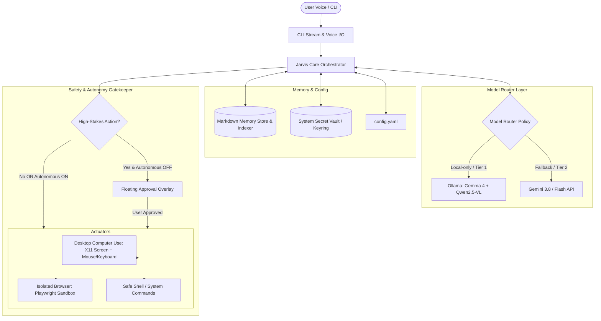

# Architecture & Implementation Plan: Jarvis Personal Assistant

Jarvis is an autonomous, cost-effective AI assistant designed to execute complex tasks across desktop applications and isolated web browsers on Linux X11. It combines local vision-language models running on your NVIDIA RTX 3060 GPU with cloud escalation (Gemini 3.8 Flash), a voice-enabled CLI, an approval overlay for high-stakes actions, and a Markdown-indexed memory system.

---

## User Review Required

> [!IMPORTANT]
> **Key Architectural Refinements Incorporated from User Review:**
> 1. **Zero-Billing & Cost Optimization:** 
>    - Primary engine runs **100% Local ($0 cost, no API keys or billing required)** leveraging your 12 GB RTX 3060: `gemma4:12b` for reasoning/code and `qwen2.5vl:7b` for vision/computer use.
>    - Optional cloud tier can use **Google AI Studio's 100% Free Tier** (which requires *no credit card or billing setup*, offering free RPM/TPM limits with a free key from `aistudio.google.com`), or remain strictly `local_only`.
> 2. **Python Task Runner:**
>    - Added dedicated Python execution actuator (`jarvis/actuators/python_runner.py`) capable of running automated tasks, executing data processing routines, sending messages via Telegram bot API, and running custom Python scripts in the background.
> 3. **Configurable Output Modality:**
>    - User-configurable `output_mode: "both" | "cli" | "voice"`. The assistant can stream logs to the terminal, speak responses, or both simultaneously.
> 4. **Lean & Structured On-Demand Markdown Memory:**
>    - Memory files in `~/.jarvis/memory/` are split into compact, modular topics (`preferences.md`, `contacts.md`, `system.md`, `workflows/`, `credentials_map.md`).
>    - An on-demand selector only loads specific memory files relevant to the current user intent, preventing context bloat.
> 5. **Safety & Autonomy:**
>    - `autonomous_mode: false` by default. High-stakes actions (payments, emails, destructive bash/python code, credential entry) trigger an on-screen approval overlay. Toggleable to `true` when full autonomy is desired.


---

## System Architecture



---

## Proposed Changes

We will create the project using `uv` with a modular Python package structure in `~/code/ai/jarvis`.

```
~/code/ai/jarvis/
├── pyproject.toml
├── config.yaml
├── .env.example
├── jarvis/
│   ├── __init__.py
│   ├── main.py                     # Main CLI entrypoint
│   ├── config.py                   # Pydantic configuration loader
│   ├── core/
│   │   ├── __init__.py
│   │   ├── agent.py                # ReAct orchestrator loop
│   │   ├── state.py                # Task context and state machine
│   │   └── safety.py               # Safety classifier and risk checker
│   ├── models/
│   │   ├── __init__.py
│   │   ├── base.py                 # Abstract LLM / VLM provider interface
│   │   ├── router.py               # Policy router (local_only, hybrid, cloud_only)
│   │   ├── ollama_provider.py      # Ollama integration (Gemma 4 + Qwen2.5-VL)
│   │   └── gemini_provider.py      # Google GenAI SDK integration
│   ├── actuators/
│   │   ├── __init__.py
│   │   ├── base.py                 # Action definition & protocol
│   │   ├── desktop.py              # X11 screenshot grabber, coordinate scaler, mouse/keyboard
│   │   ├── browser.py              # Playwright isolated browser automation
│   │   └── shell.py                # Sandboxed local command execution
│   ├── voice/
│   │   ├── __init__.py
│   │   ├── stt.py                  # Local faster-whisper on GPU
│   │   └── tts.py                  # Fast local TTS (piper / edge-tts)
│   ├── memory/
│   │   ├── __init__.py
│   │   ├── store.py                # Markdown file manager (~/.jarvis/memory)
│   │   └── indexer.py              # Semantic / keyword indexer for runtime context loading
│   ├── security/
│   │   ├── __init__.py
│   │   └── vault.py                # Keyring / Secret Service credential manager
│   └── ui/
│       ├── __init__.py
│       ├── console.py              # Rich live log streaming in CLI
│       └── overlay.py              # Lightweight Tkinter/PyQt approval overlay dialog
└── tests/
    ├── test_router.py
    ├── test_safety.py
    ├── test_memory.py
    └── test_actuators.py
```

---

### Component Breakdown

#### 1. Configuration & Project Setup
- **`pyproject.toml`**: Managed via `uv`. Dependencies include:
  - `pydantic`, `pyyaml`, `rich` (config and CLI)
  - `google-genai`, `requests` (model APIs)
  - `playwright` (isolated browser automation)
  - `pyautogui`, `mss`, `pillow`, `pynput` (X11 desktop computer-use)
  - `faster-whisper`, `edge-tts`, `sounddevice` (voice STT/TTS)
  - `keyring` (secure secret store)
- **`config.yaml`**: User-configurable settings for model tiering (`policy: local_only | hybrid | cloud_only`), `autonomous_mode: false`, high-stakes triggers, and audio device preferences.

#### 2. Model Routing Layer (`jarvis/models/`)
- Unified interface for text planning and vision coordinate detection.
- **Local Provider**: Directly interfaces with existing Ollama models:
  - `gemma4:12b` for text reasoning, planning, and task decomposition.
  - `qwen2.5vl:7b` for visual grounding (screenshot + prompt -> `[x, y]` coordinates).
- **Cloud Provider**: Interfaces with Gemini 2.5 Flash / Gemini 3.8 via `google-genai` with streaming support.
- **Router**: Configurable fallback policy. In `hybrid` mode, tasks start locally; if local vision confidence is low or an error occurs, it smoothly escalates to Gemini.

#### 3. Vision-Based Desktop "Computer Use" (`jarvis/actuators/desktop.py`)
- Screen capture using `mss` (high-performance X11 screen capture).
- Coordinate transformation (maps normalized 0–1000 coordinates from vision models to exact physical display pixels).
- Mouse actions: move, click, double click, right click, drag, scroll.
- Keyboard actions: type text, press key, keyboard shortcuts (e.g., `Ctrl+C`, `Enter`, `Tab`).
- Visual verification: captures post-action screenshots to verify button states or visual changes.

#### 4. Isolated Browser Actuator (`jarvis/actuators/browser.py`)
- Spins up a dedicated Playwright instance with an isolated user profile.
- Supports both headless background runs and headed mode.
- Dual-mode control:
  - Visual mode: screenshots sent to VLM for click/type coordinate prediction.
  - DOM/Accessibility mode: direct CSS/XPath interaction for rock-solid web navigation when specified.

#### 5. Safety & Approval Overlay (`jarvis/core/safety.py`, `jarvis/ui/overlay.py`)
- Action risk classifier evaluates actions:
  - Safe: Navigation, scrolling, clicking harmless UI, reading text.
  - High-Stakes: Email sending, payments/checkout buttons, bash scripts with deletes/system modifications, credential submission.
- If high-stakes and `autonomous_mode: false`:
  - Triggers a sleek, borderless, always-on-top desktop overlay dialog.
  - Shows screenshot crop of the target, action summary, and risk details.
  - User can Approve (`Enter`), Reject (`Esc`), or dictate an adjustment.

#### 6. Voice & CLI Interface (`jarvis/voice/`, `jarvis/ui/console.py`)
- **CLI**: Rich-based terminal interface with real-time log streaming, thought bubbles, and action breadcrumbs.
- **Voice**:
  - Speech-to-Text: `faster-whisper` running locally on CUDA (RTX 3060).
  - Text-to-Speech: `edge-tts` / `piper` for audio responses.
  - Hotkey push-to-talk or continuous VAD mode.

#### 7. Markdown Memory & Vault (`jarvis/memory/`, `jarvis/security/vault.py`)
- Stores persistent knowledge in `~/.jarvis/memory/` as Markdown files:
  - `preferences.md` (user preferences, system setup, guidelines).
  - `tasks/` (task execution logs, learned recipes for websites and desktop apps).
  - `contacts.md`, `credentials_map.md`.
- Simple keyword/BM25 & vector indexer to dynamically pull relevant memory sections into context before planning.
- Credential vault via Linux Secret Service (`keyring`), storing passwords and API tokens safely without plaintext in markdown.

---

## Verification Plan

### Automated Tests
1. **Model Router Test (`tests/test_router.py`)**:
   - Verify Ollama connection with `gemma4:12b` and `qwen2.5vl:7b`.
   - Verify fallback mechanism when local provider errors.
2. **Safety Gatekeeper Test (`tests/test_safety.py`)**:
   - Verify action classification (safe vs high-stakes).
   - Test approval flow when `autonomous_mode: false` vs `autonomous_mode: true`.
3. **Memory & Vault Test (`tests/test_memory.py`, `test_vault.py`)**:
   - Test storing and retrieving indexed `.md` notes.
   - Test `keyring` storage and retrieval of mock credentials.
4. **Actuators Test (`tests/test_actuators.py`)**:
   - Test X11 screen capture speed (<50ms).
   - Test coordinate normalization and boundary checks.
   - Test Playwright isolated browser launch and navigation.

### Manual Verification
1. **Desktop Action Flow**:
   - Run CLI command: `jarvis "open calculator and compute 123 * 456"`.
   - Verify screenshot capture, visual click sequence, and result confirmation.
2. **Approval Overlay**:
   - Run action targeting an email or delete command.
   - Verify approval popup appears, waits for user input, and respects rejection or approval.
3. **Browser Automation**:
   - Run CLI command: `jarvis "search Wikipedia for the James Webb Space Telescope and summarize the first paragraph"`.
   - Verify isolated browser launches, performs task, and reports back via CLI/voice.
