# Jarvis Evolution: Full Personal Assistant & Automation System

This plan details the Phase 2 upgrade for Jarvis, turning it from a CLI tool into an autonomous, proactive, multi-modal personal assistant.

---

## User Review Required

> [!IMPORTANT]
> **Key Architecture Decisions for Phase 2:**
> 1. **Decoupled Graphical UI:** A standalone, high-performance web dashboard running on `http://127.0.0.1:8765` built with a **Stark Industries / Iron Man HUD design aesthetic** (deep obsidian, neon cyan accents, glassmorphic panels). Communicates with Jarvis via WebSockets for real-time thought streaming, step logs, hardware telemetry, and run history inspection.
> 2. **System Lifecycle (Master ON / Kill-Switch):** A centralized process supervisor (`jarvis/core/supervisor.py`) tracking PID files in `~/.jarvis/`. Commands `jarvis start` and `jarvis stop` (or the one-click UI Kill Switch) cleanly bring up or terminate all background daemons (UI server, Hotkey listener, Telegram bot, Watchdogs).
> 3. **Hardware & Latency Strategy:**
>    - **Persistent Keep-Alive:** Locks `gemma4:12b` and `qwen2.5vl:7b` in GPU VRAM/RAM with `keep_alive: -1`, eliminating the 1–2 minute HDD cold-start penalty.
>    - **Tier-0 Instant Router:** Uses local `llama3.2:3b` for sub-100ms intent classification, routing routine questions and fast tasks instantly.
> 4. **Dual Browser Strategy:** Adds a one-click launcher on the UI and CLI to spawn your everyday Chrome/Brave browser with `--remote-debugging-port=9222`, allowing Jarvis to attach via Chrome DevTools Protocol (CDP) to your existing logged-in sessions (GitHub, Gmail, Slack, etc.) while keeping the isolated Playwright sandbox available.
> 5. **Iron Man Voice Profile:** Configures `edge-tts` with `en-GB-RyanNeural` (British male AI butler) with tuned pitch and cadence.

---

## Architecture Overview

```mermaid
graph TD
    subgraph User Touchpoints
        WebUI[Decoupled Web Dashboard :8765]
        Spotlight[Desktop Spotlight Bar Alt+J]
        Telegram[Telegram Bot Remote Daemon]
        Voice[Voice I/O Iron Man Jarvis]
    end

    subgraph Core Supervisor & Lifecycle
        Supervisor[Master Process Supervisor]
        KillSwitch[Master Kill / Startup Switch]
        Supervisor --> KillSwitch
    end

    WebUI <--> Supervisor
    Spotlight <--> Supervisor
    Telegram <--> Supervisor

    subgraph Intelligence & Models
        Tier0[Tier-0 Router: Llama 3.2 3B <100ms]
        KeepAlive[Persistent Keep-Alive Daemon]
        Tier1[Tier-1 Logic: Gemma 4 12B]
        TierVision[Vision Grounding: Qwen2.5-VL 7B]
        TierCloud[Cloud Fallback: Gemini 3.8 / 2.5]
    end

    Supervisor --> Tier0
    Tier0 --> KeepAlive
    KeepAlive --> Tier1
    KeepAlive --> TierVision
    Tier0 --> TierCloud

    subgraph Actuators & Automation
        DesktopAct[X11 Desktop Computer Use]
        MacroRec["Watch & Learn" Macro Recorder]
        BrowserSandbox[Isolated Playwright Browser]
        BrowserCDP[Everyday Chrome CDP Attach :9222]
        PythonRun[Python Task & Data Runner]
    end

    Supervisor --> Actuators
    Actuators --> DesktopAct
    Actuators --> MacroRec
    Actuators --> BrowserSandbox
    Actuators --> BrowserCDP
    Actuators --> PythonRun

    subgraph Proactive Watchdogs
        HW[Hardware Sentinel GPU Temp / Disk]
        Cron[Scheduled Morning Briefings]
        Org[Download Folder Auto-Organizer]
    end

    Supervisor --> HW
    Supervisor --> Cron
    Supervisor --> Org

    subgraph Audit & Storage
        Audit[Run History & Filmstrip Store]
        MemStore[Lean Markdown Memory]
        Vault[Secret Vault]
    end

    Supervisor --> Audit
    Supervisor --> MemStore
    Supervisor --> Vault
```

---

## Proposed Changes

### Component 1: System Responsiveness & Hardware Acceleration
- **`src/jarvis/models/tier0.py`**:
  - Implements Tier-0 Fast Classifier using local `llama3.2:3b`.
  - Determines intent in <100ms: `DESKTOP_GUI`, `BROWSER`, `PYTHON_TASK`, `SYSTEM_SHELL`, `CONVERSATION`, or `WATCHDOG_COMMAND`.
  - Extracts key entities and passes pre-structured commands to `gemma4:12b` or direct actuators without latency.
- **`src/jarvis/models/ollama_provider.py`**:
  - Update payloads with `"keep_alive": -1` to prevent Ollama from unloading models from VRAM/RAM to the slow HDD.
  - Implement a pre-warm routine (`warmup()`) that ensures models are loaded into RAM at assistant startup.

### Component 2: Decoupled Graphical UI & API Server
- **`src/jarvis/ui/server.py`**:
  - FastAPI web server running asynchronously on `127.0.0.1:8765`.
  - WebSocket endpoint `/ws/stream` for live token/log streaming, task breadcrumbs, and hardware telemetry.
  - REST endpoints:
    - `/api/task` (submit task)
    - `/api/status` (current running task and system metrics)
    - `/api/history` (fetch past runs, step logs, screenshots)
    - `/api/browser/launch-cdp` (launch everyday browser with CDP enabled)
    - `/api/system/kill` & `/api/system/start` (lifecycle controls)
    - `/api/vault` & `/api/memory` (inspect and edit notes and keys)
- **`src/jarvis/ui/web/`**:
  - Standalone single-page frontend (HTML5/CSS3/Vanilla JS) inspired by **Stark Industries / Iron Man HUD**:
    - Cyberpunk dark palette (`#080c14`, `#00e5ff`, `#102a43`, glassmorphism backdrop filters).
    - **Command Center:** Real-time chat, speech input button, live log streaming terminal, action badges.
    - **Visual Audit Inspector:** Browse past execution runs with interactive filmstrip, before/after screenshot diffs, and timing.
    - **Hardware Gauges:** Real-time RTX 3060 VRAM usage, GPU temperature, CPU utilization, RAM usage.
    - **Action Center:** Dual-browser launch button, master Kill Switch, Watchdog toggles.

### Component 3: Global Hotkey & Desktop Spotlight Bar
- **`src/jarvis/ui/spotlight.py`**:
  - X11 Hotkey listener (`Alt+J` or `Super+Space`) via `pynput`.
  - Spawns a floating, frameless, translucent Spotlight search bar centered on screen.
  - **Context-Awareness:**
    - Automatically queries active X11 window title via `python-xlib`.
    - Automatically captures current clipboard text via `pyperclip` / `xclip`.
    - Allows typing a task or clicking the microphone icon to dictate.
    - Sends the enriched prompt `[Active Window: VS Code | Clipboard: ...] Goal: <user_input>` directly to Jarvis.

### Component 4: Two-Way Telegram Remote Daemon
- **`src/jarvis/remote/telegram_bot.py`**:
  - Asynchronous Telegram bot service using polling mode (zero public webhook setup required).
  - Restricted to authorized `telegram_chat_id` stored in vault.
  - Supported remote commands:
    - `/run <task>`: Executes a task on the workstation and streams back progress updates.
    - `/status`: Returns GPU temp, VRAM usage, active processes, and background tasks.
    - `/screen`: Captures a current screenshot of the workstation and sends it as a photo.
    - `/kill`: Triggers the kill-switch remotely.
  - Proactive push notifications: Alerts user on phone when hardware anomalies occur or when scheduled jobs complete.

### Component 5: "Watch & Learn" Macro Recorder & Dual Browser CDP
- **`src/jarvis/actuators/recorder.py`**:
  - Records successful multi-step action sequences.
  - Compiles visual trajectories into deterministic Python scripts using Playwright or PyAutoGUI.
  - Saves macros to `~/.jarvis/memory/workflows/<name>.py`.
  - Next time the goal matches, runs the deterministic script directly in <1 second with 100% fidelity.
- **`src/jarvis/actuators/cdp_browser.py`**:
  - Launches Chrome/Brave with `--remote-debugging-port=9222` and user's profile.
  - Connects Playwright to existing tabs via `chromium.connect_over_cdp("http://localhost:9222")`.
  - Enables automating logged-in accounts without re-entering 2FA or solving CAPTCHAs.

### Component 6: Proactive Background Watchdogs
- **`src/jarvis/watchdogs/sentinel.py`**:
  - Monitors RTX 3060 temperature (alert if >80°C), VRAM leaks, and disk space (<10% free).
- **`src/jarvis/watchdogs/organizer.py`**:
  - Watches `~/Downloads` for new files. Automatically categorizes and moves them to `~/Documents`, `~/Code`, `~/Media` with notifications.
- **`src/jarvis/watchdogs/cron_engine.py`**:
  - Morning Briefing at configurable time: Gathers weather, unread notifications, calendar, and speaks summary using Iron Man voice.

### Component 7: Process Supervisor & Master Kill-Switch
- **`src/jarvis/core/supervisor.py`**:
  - Manages subprocesses: UI Web Server, Spotlight listener, Telegram daemon, Watchdogs.
  - Writes PID file to `~/.jarvis/supervisor.pid`.
  - Commands:
    - `jarvis start`: Boots all background services in parallel.
    - `jarvis stop`: Clean, graceful SIGTERM/SIGKILL of all managed processes.
    - `jarvis status`: Displays running daemons, uptime, and memory consumption.
  - Accessible via CLI, Web UI button, and Telegram `/kill`.

### Component 8: Visual Audit Trail & Action Replay
- **`src/jarvis/core/audit.py`**:
  - For every task execution, creates `~/.jarvis/runs/<timestamp>_<task_slug>/`:
    - `run_metadata.json`: Goal, timing, model tier used, success/failure status.
    - `steps.json`: Structured log of every thought, action, parameters, and observation.
    - `screenshots/`: Filmstrip of before/after screenshots for every action.
  - Integrated into the Web UI History tab for visual playback.

### Component 9: Iron Man JARVIS Voice Profile
- **`src/jarvis/voice/tts.py`**:
  - Updated default voice: `en-GB-RyanNeural`.
  - Rate: `+2%`, Pitch: `-4Hz` to match Paul Bettany's refined, calm, slightly metallic British AI persona.
  - Added optional audio chime / activation tone before speaking.

---

## Verification Plan

### Automated Tests
1. **Tier-0 Router Tests (`tests/test_tier0.py`)**:
   - Verify intent classification latency (<100ms) on sample prompts.
2. **Ollama Keep-Alive Tests (`tests/test_keepalive.py`)**:
   - Verify `keep_alive: -1` in request payloads.
3. **Macro Recorder Tests (`tests/test_recorder.py`)**:
   - Test recording action events and compiling into executable Python script.
4. **CDP Browser Tests (`tests/test_cdp.py`)**:
   - Test CDP connection and port checking logic.
5. **Supervisor Lifecycle Tests (`tests/test_supervisor.py`)**:
   - Test process startup, PID tracking, and graceful kill-switch shutdown.
6. **Audit Trail Tests (`tests/test_audit.py`)**:
   - Test session serialization and screenshot filmstrip generation.

### Manual Verification
1. **Web UI Dashboard**:
   - Boot dashboard via `uv run jarvis start`.
   - Open `http://127.0.0.1:8765` in browser. Verify Stark HUD styling, telemetry gauges, and WebSocket live log streaming.
2. **Kill Switch & Master ON Switch**:
   - Click "Kill Switch" on the dashboard. Verify all background daemons terminate cleanly.
   - Run `jarvis start` and verify clean reboot.
3. **Spotlight Bar**:
   - Press `Alt+J`. Verify floating spotlight bar appears with active window title and clipboard pre-populated.
4. **Dual Browser CDP**:
   - Click "Launch Everyday Chrome" button. Verify Chrome opens with port 9222 and Jarvis attaches to the tab.
5. **Telegram Bot**:
   - Send `/status` and `/screen` from mobile Telegram. Verify reply and screenshot delivered.
6. **Iron Man Voice**:
   - Trigger a task with `output_mode: "voice"`. Confirm British JARVIS voice audio synthesis.
